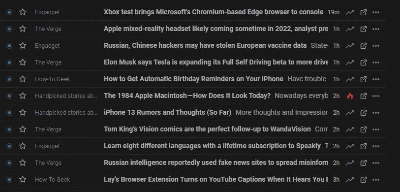

# RSS for productivity

Imagine if all the different e-mail systems (Gmail, Outlook, etc.) were not interoperable. In that world, if you wanted to check for new messages from just five of your friends, you would have to go to _five_ different websites and access _five_ different e-mail systems. Some might have new messages, some might not, and to make it even more difficult, each of the e-mail systems looks a little different. None differentiate between e-mails you have previously read and e-mails that are new, and none of them display the e-mails in quite the same way. Some show a list of titles, others a summary, and some don't even show the latest e-mails at the top, they use AI to determine what they think is the most important e-mail!

The imaginary e-mail system described above is a "solution" to the problem of, "How do I stay up to date with my friends?" It's not a good solution, but it is a solution (it's actually the situation we're currently in with instant messaging), and luckily it's not how it works in the real world. E-mail uses a standard protocol (ok, [three protocols](https://www.siteground.co.uk/tutorials/email/protocols-pop3-smtp-imap/)), you can choose your e-mail application, you can choose your e-mail provider, and you can view e-mails from all your friends in your chosen application. Not only that, but having all the e-mails in a single place has advantages other than just simplifying the aggregation process. You get to determine how the e-mails appear, what order they are in, you get to tag them, put them in various folders, and even run complex rules based on their content etc. And, five years later, when you're trying to remember how much you paid for that thing you bought from some website the name of which you can't remember&hellip; you just search your e-mails.

E-mails are data, it's unstructured of course, but it is data nonetheless. More than **80 percent** of all data generated today is considered unstructured, and the e-mail protocols and e-mail apps do a great job of allowing us to manage some of that unstructured data. But, what about news?

News is also data, and like e-mails, it's unstructured. Most people who are trying to keep up to date with the latest news will visit a variety of different websites, each website will look a little different, they will all prioritise the articles differently, and none will differentiate between articles that are new to you versus those you've already seen. It's similar to the imaginary (and horrible) e-mail situation I described above.

What if you could collect all the new articles together in a single application? What if you didn't have to visit the websites to check for new content? What if all the new content could be delivered to you and displayed in a simple list with the articles sorted and displayed the way you wanted? To achieve this, there would have to be some form of agreed standard, not unlike the protocols on which e-mail is built. Well, there is. It's called RSS, and it's existed for more than 20 years.

## What is RSS?

RSS (Really Simple Syndication) is a web feed that allows users and applications to access updates to websites in a standardised, computer-readable format. These feeds can, for example, allow you to keep track of many (potentially, hundreds) different websites in a single news aggregator.

Below you can see an example of the contents of an RSS feed. It's simply a channel (e.g. your favourite news site), followed by a list of articles. Users of RSS never actually look at the feed (in the same way that you never see all the metadata associated with each e-mail you receive), it's not meant for people, it's meant for machines, i.e. the RSS aggregators.

    <channel>
    <title>OnlyRSS</title>
    <link>https://onlyrss.org</link>
    <description>The latest posts from OnlyRSS.org</description>
    <item>
        <title>It's Spring, what should you be doing in your garden?</title>
        <link>https://onlyrss.org/drawing-with-excalidraw</link>
        <description>Excalidraw is described by its creators as a "Virtual whiteboard for sketching hand-drawn like diagrams"....</description>
    </item>
    <item>
        <title>Weed control special</title>
        <link>https://onlyrss.org/working-from-home-hardware</link>
        <description>I recently wrote about my weekday lockdown routine. In this article I'll be describing the hardware I use to do my job while...</description>
    </item>
    </channel>

## RSS aggregators

**An RSS aggregator is similar to an e-mail client, but rather than e-mails, it aggregates articles**. And like e-mail applications, some RSS aggregators are desktop apps, and others are online applications. [Feedly](https://feedly.com/) and [Inoreader](https://www.inoreader.com/) are two popular online versions and both have similar capabilities.

Here's how the example above could appear in an RSS aggregator. It doesn't have to appear like this, for example, you could choose to view a list of just the titles, or you could select to step through each article in turn (no different to the options you would get in any decent e-mail client).

### It's not just articles

For simplicity, so far I've only discussed articles, but RSS aggregators can do more than just show you the latest news. Below is a list of the various types of content that you can aggregate:

- Articles
- Blog posts
- Forum posts
- Videos e.g. YouTube
- Keyword search alerts e.g. Google\Bing etc.
- Newsletters
- Daily weather reports
- Podcasts
- Updates to documents e.g. Wikipedia, Confluence etc.
- Status changes e.g. parcel tracking, Jira tickets etc.
- Price alerts e.g. CamelCamelCamel etc.

### ...and it's not just aggregation

The basic requirement of an RSS aggregator is that it aggregates content via RSS feeds. But, much like e-mail clients, RSS aggregators tend to offer more than just this basic capability. In addition to aggregating content, RSS aggregators can offer other benefits, e.g.:

- Searching for feeds (so you don't have to hunt down the feed at the source website)
- Keyword search results e.g. allowing you to see all new Google results for a keyword search
- Deduplication i.e. remove or bundle together articles with similar content
- Prioritise content e.g. highlight all content that includes a certain keyword, or from a specific source.
- Mute content e.g. hide all content that contains a certain keyword or phrase like "Game of Thrones finale"
- Store all read content and index for search
- Tag content to be 'read later'
- Tag content as 'favourite'
- Group content into folders, or apply categories e.g. UX, DataViz, etc.
- Highlight sections of content and add notes
- Share content e.g. directly to social networks, as an e-mail newsletter, or even an RSS feed!

## Summary

Hopefully I've managed to explain what RSS is, and also to convey some of the benefits of using an RSS aggregator. My original plan for this article was to also describe in detail how I use an RSS aggregator (specifically Feedly) to keep on top of my various interests, but I didn't want anyone reading this article to be overwhelmed and to lose sight of the one key takeaway i.e. **RSS is a powerful tool for keeping on top of online content, and keeping your knowledge up to date**.
