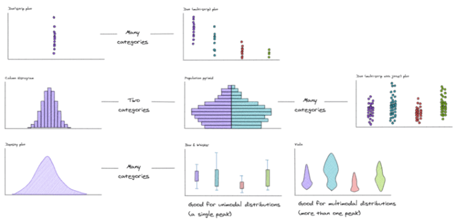

# Chart Picker

## Background

Whether you work in data science, data analytics, finance, strategy, user experience, sales, marketing, or product, at some point you will be creating data visualisations, either for use externally (in your products and on social media), or internally (in your presentations and reports). As an employee of an information and analytics company, it’s important that the visualisations I choose reflect the same high standard as the underlying data, or at the very least, don’t misrepresent the data.

As a product manager, I’ve used a variety of tools over the years to create mock-ups. Some tools output high-fidelity designs, but typically I’m dealing with high-level concepts that need to be created quickly and updated often (based on user feedback). For these scenarios, I’ve recently started using a free and open-source tool called [Excalidraw](https://excalidraw.com/) (see my blog post about [Drawing with Excalidraw](../posts/drawing-with-excalidraw.html)).

During early 2021 I was managing the rebuild of one of my company's analytics tools, and the new version required the extensive use of charts in order to visualise a wide variety of data, as usual, I turned to Excalidraw to create the initial mock-ups. Before I knew it, I had amassed a large number of basic chart types, so I turned these into an Excalidraw library and added my library to the project in [GitHub](https://github.com/excalidraw/excalidraw-libraries). You can download my library [here](https://libraries.excalidraw.com/?sort=default#dbssticky-data-viz) (title: 'Data Viz', author: '@dbs-sticky').

I then decided to take my library of charts and generate a “chart picker” diagram. I based this off an existing concept developed by Dr. Andrew Abela from [ExtremePresentations](https://extremepresentation.com/) (anyone interested in charting is probably already familiar with this [classic version](https://extremepresentation.com/design/7-charts/)). I made some changes to Dr. Abela's design, mostly around the Distribution section which I have expanded with more options. My diagram is designed to help you choose a chart based on your data, and what you are trying to convey to the user. My initial aim for creating this chart picker was to share it with my colleagues, I've since shared it publicly, and have now made it available on [GitHub](https://github.com/dbs-sticky/ChartPicker) for anyone to use or to improve upon.

## Chart Picker links

- [View\download the chart picker as a .png/images/chart-picker-compressed.png)
- [View\download the chart picker as a .svg](../images/chart-picker-compressed.svg)
- [View\edit your own instance of the chart picker at Excalidraw](https://t.co/swXFJLvAwM)
- [Follow\contribute to the chart picker project at GitHub](https://github.com/dbs-sticky/ChartPicker)

## Chart Picker screenshot

This is a zoomed in view of the distribution section of the chart picker.

