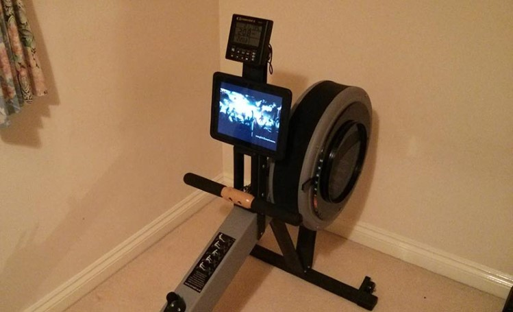
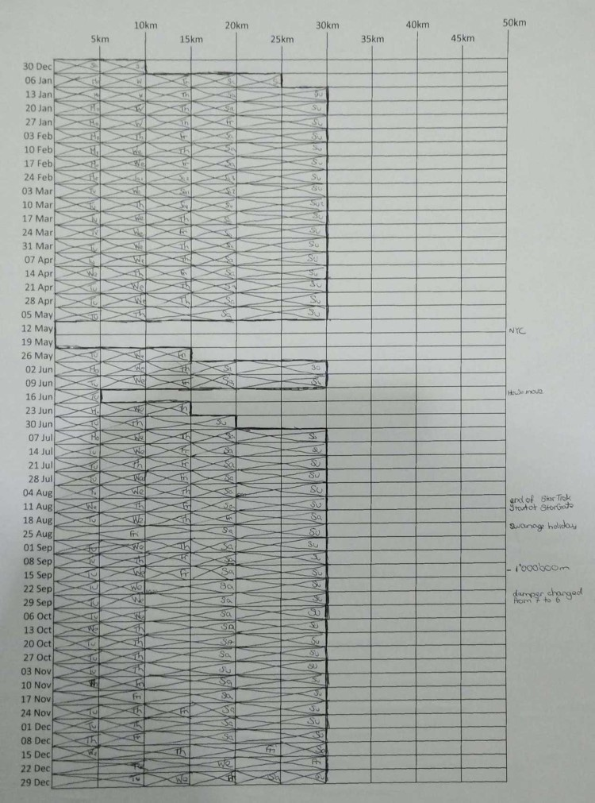
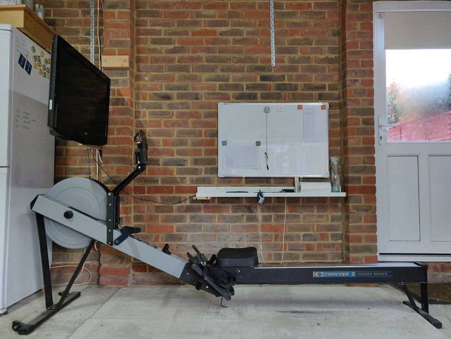

## Background

I bought my [Concept 2 Model C](https://www.concept2.com/service/indoor-rowers/model-c) rower in 2001, my plan (like most people who buy exercise equipment) was to use it every week. And, like most people, I failed. I used the rower sporadically for a while, and then I moved house, and it just sat there in my new home, gathering dust. I'd get the urge to start using it again (yes...January) and as usual, it didn't last. I've always done some form of exercise, either in the gym or running, and have had some long periods of running every week, but I don't think I've ever exercised consistently every week for a period longer than a year.

## 2014 - New Year's day

This all changed when I hit 40. My daily routine was basically, driving to work, sitting at my desk for 8hrs, driving home, making the family dinner, and then sitting in front of the TV with the wife for an hour or so before bed. This was not exactly an active lifestyle. So I made a New Year's resolution to row at least 30km every week (4x5km, 1x10km). I used Excel and made a big table where each row was a week, and each column was 5km (it had 10 columns, so 50km). I printed the table on A3 paper, and stuck it up on the wall in the garage right next to the rowing machine. The aim was simple, "don't break the streak", the longer I could hit 30km each week, the less likely I would be to miss a week, because I'd "break the streak". I had to start off slowly, but by week 3 I was up to 30km, and with the exception of a few weeks (house move, and a work trip to NYC) I hit my target. But the table was not the thing that kept me going, 30km per week on the rower meant about 2 1/4 hrs of my time, and just rowing can be boring. To help alleviate the boredom I attached my iPad to the rower, got some sports headphones, and started watching Star Trek (original) from the very beginning. **Exercise time was now also Star Trek time!**. When I got to the end of Star Trek, I watched Stargate SG1, all 10 seasons, and then Atlantis, and then...you get the idea. I watched TV that I would look forward to. During September I hit 1,000,000 meters, and as I'd been logging my rows in the Concept 2 online log book, I qualified for my free 1 million meter t-shirt and badge.

Here's an image of the initial simple setup:

And here's the chart for my first year:

## 2015

2015 carried on much like 2014, 30km per week (this time I didn't miss any weeks). I hit 2 million meters in May (you don't get any freebies for 2 million) and I also rowed my first 20km. I did my first 1/2 Marathon in July, and then my 2nd in December, when I also hit 3 million meters.

## 2016 - This is the year when I realised I had been lazy

There were three things that happened in 2016 that made me realise that I needed to up my game:

1. I set a New Year's resolution to row a Marathon by the end of the year.
2. I read [Row Daily, Breathe Deeper, Live Better: A Guide to Moderate Exercise.](https://www.amazon.co.uk/Daily-Breathe-Deeper-Live-Better/dp/0595434371)
3. A friend of mine casually mentioned that she swam for an hour each day.

2016 started well, with my 3rd 1/2 Marathon in January, but by week 6 my long running streak was broken due to a case of "man-flu" that lasted more than 2 weeks. There followed another couple of 1/2 Marathons during the year. But, it was points 2) and 3) that eventually led me to reassess my rowing goal of 30km per week, and this happened in August.

I was already doing a lot of what was discussed in "Row Daily, Breathe Deeper, Live Better: A Guide to Moderate Exercise", but it was only when I got to the chapter on case studies that it suddenly occurred to me that the book was targeted at old people (ok, at this time I was 43...but I mean really old people, as in 60+). All the case studies were of people in their 60s and 70s. **So, here was me thinking that my 30km per week was pretty good, and here's this book encouraging people in their 70s to row 70km per week!** Combined with my friend doing an hour swim every day, I realised that it was time to up my game. So, during August I set a new goal of 70km per week (typically 7x10km). I rowed my first Marathon in November (3hr12m53.6s, 2:17/500m,), and hit 5 million meters in the first week of January (finally...a new t-shirt and badge).

## Setting challenges - 100km in a day

Each year I try and set a new rowing challenge, this is typically something like "row a Marathon this year", or "beat my 10km time", but during 2017 I set myself the challenge of rowing 100km in a day, I started around 8am and rowed 10km, then had a 30min break, followed by another 10km, and so on, unfortunately after 80km I had some serious knee pain, so had to stop.

During late 2020 I was approaching the 15 million meter mark, so decided to attempt the '100km in a day' challenge again, but I timed it such that I'd hit the 15 million meters during the 100km attempt. I started around 8am, finished around 11pm, and spent around 9hrs on the rower in total. This time there were no knee issues, **I'd done it! and I swore to never do it again**, it was probably the hardest physical activity I'd ever done. Rowing 10x10km in a day requires similar effort to running 10x10km in a day (ok, maybe about 80% when compared to running). Note: Two ladies in France each managed to row [100km per day, every day, for a month!](https://www.row2k.com/features/899/100k-A-Day-Keeps-The-Doctor-Away/) That's more than 3 million meters in a month (it typically takes me around 2 years to row 3 million meters). When setting goals, don't worry about what other people are doing (it's a big world with a lot of talented people), if you do it will only demotivate you. Your goals should be personal to you.

## Concept 2 setup, maintenance, and upgrades

My rowing setup has evolved over the years to the point where I'm quite happy with the current configuration, which includes:

- A dedicated wall mounted TV
- An Ethernet connected Amazon Fire TV stick (you don't want to be dealing with Wi-Fi issues 1/2 way through your row)
- An Amazon Echo (for audio and voice control of the TV).
- A wall chart for marking off each row.

Here's the current setup:

At the end of this Summer (2021) my Concept 2 will be 20 years old. Concept 2s are built to survive the harsh environment of commercial gyms, if you buy one for home use, they should last forever and require very little maintenance (they also hold their value well, during the pandemic my rower was still worth about 80% of what I paid for it!). Most of the changes I've made to mine have not actually been required, here's how I've maintained and upgraded it over the last 20 years:

- After each row, I clean the main rail with glass cleaner (as the seat rollers collect gunk).
- Every month I oil the chain, nothing fancy, just some basic 3-in-1.
- Every year I give the main flywheel enclosure a vac to get rid of the dust.
- Every year or so I replace the batteries in the Performance Monitor (PM). Not because they are flat, but to reduce the chance of them leaking and killing the PM.
- Every 3 million meters or so I replace the seat rollers, they cost around £28.
- I upgraded the handle from the original Model C version to the version that ships with the Model D and E. There was nothing wrong with the original handle, I just wanted to use the latest version.
- I upgraded the PM from the PM2+ that it originally came with, to the latest PM5. Again, this was not really necessary as the PM2+ was working just fine, but, I wanted to link the PM to a phone, so I could automatically log all my rows with the Concept 2 online logbook (I'd been adding them manually up to this point). The PM5 is quite expensive (£155), but, I got £90 for my PM2+ on eBay, so the upgrade only set me back £65.
- I few years ago I bought a replacement bungie cord (the part that pulls back on the handle), but I've not got around to fitting it yet.

## My tips for anyone who's new to indoor rowing

- There's nothing harder than getting home from work, and then dragging your arse back out again to go to a gym. **If you can, buy a rower**, Concept 2s hold their value really well, if it turns out that rowing is not for you, just sell it.
- Set a goal, print out a table/chart, and mark off each row, **start a streak**, and try to keep it going.
- Attach a tablet to the rower, or set up a TV and watch some sci-fi (other genres are acceptable), or listen to podcasts or audio books, but **do something that will keep your mind occupied**.
- **Put some padding on the seat**, those things are not meant for long rows!
- **Log your rows with the Concept 2 Logbook**, the rewards might not be much, but I wear my t-shirt with pride.
- [Sign up to the Concept 2 forum](https://www.c2forum.com/), it's a good place to get answers to any rowing or Concept 2 related questions.

## Summary

Rowing is now part of my lifestyle, it's fully integrated into my [daily routine](../posts/anatomy-of-a-lockdown-day.html). I'm not trying to break records (obviously, I'm watching TV at the same time), but I am trying to make up for the 8hrs a day I spend sitting at a desk, and to be honest, 10km per day is probably only just managing that.
