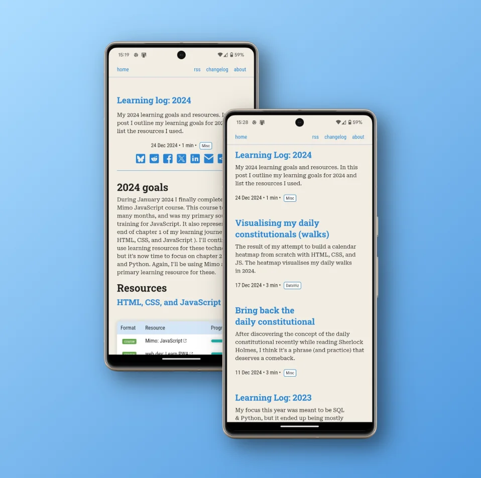

# Why Product Managers need to embrace the tech

I've been a Product Manager for 16 years. I don't mean I've worked *in* product management for 16 years, I mean I've literally had the Individual Contributor (IC) role of Product Manager (PM) for 16 years.

Does this mean I lack the skills required to become a Director-, VP-, or Chief-of-Product? No idea, it's never occurred to me to apply for any of those roles. Is it just a lack of ambition then? The answer to that depends on how you define ambition. If you limit your definition of professional ambition to mean “taking on more responsibility”—which is business speak for “managing people”—then yes, I have no ambition. But, if your definition of ambition includes “trying to be as good as you can in your *current* role”, then I would consider myself to be very ambitious (surprise! I subscribe to the latter definition).

What about the financial benefits of “taking on more responsibility”, do I not like money? I do like money, or more specifically, I like what comes with having money, i.e. living a comfortable lifestyle, and being able to provide for my kids (ok, ok, I like buying gadgets!). But, I don't like money enough to simply manage a bunch of people who are doing the thing that I want to be doing.

If this all sounds like me trying to justify why I've had the same role for the last 16 years, then I've done an effective job of writing my intro paragraphs, because that's exactly what I was aiming for.

The upshot of this is that I've developed some strong“opinions”on what it takes to be a good IC PM. But before I dive into what I've learned over the last 16 years, here's my definition of Product Management (it can  mean different things in different organisations or industries).

<blockquote>A PM listens to customers, understands their problems, and then uses his/her knowledge of the technology available to define and build* solutions. </blockquote>

*in many organisations, the PM role ends with the definition, which is a shame, the building bit is one of the most rewarding aspects of being a PM—it also helps that I've never met a software engineer I didn't want to go to the pub with.

While understanding customers is crucial, that ground has been well-covered by countless PM resources. Instead, I want to focus on an equally vital but often overlooked aspect of product management: technical knowledge.

## But that's what engineers are for, right?

I always like to compare being a PM to being an architect (of buildings, not software). Imagine you're an architect who designs bespoke houses. You meet with the client, and you try and understand their unique situation e.g. Are they young or old? Do they enjoy entertaining or are they hermits? Do they have cats or dogs? Do they have (or plan to have) a large family? Do they enjoy gardening? Do they work from home? Do they own multiple cars? What's their budget? When do they want to move in?

These are important questions that need to be answered before an architect can begin the design process. The home has to be designed to meet the client's needs, but it should also be designed so that it takes advantage of the latest building materials, can be constructed economically, and that once built, is easy to maintain. To do this the architect needs to be aware of trends and advances in engineering, in building materials, in building standards etc.

Just as an architect needs to understand construction materials and engineering principles, a PM needs knowledge of the technical tools and platforms available. Without this knowledge, we risk designing solutions that are impractical, inefficient, expensive, or even impossible to build.

In other words, a PM must deeply understand not just the problem space (#obvs), but also *the solution space* to be truly effective.

What follows is a description of the types of technologies I try to keep up with, and the methods I use to ensure that I do that efficiently. I've also thrown in a few examples of how keeping abreast of these technologies has benefited me, my products, and my users. One big caveat, I'm a PM for a data analytics company with a big focus on UI products that run in the browser. If you're a PM for a company that makes [Halloween costumes for horses](https://www.equus.co.uk/collections/halloween-horse-riding), I'm sorry, this is not the blog post for you.

## The tech

### HTML, CSS, and JavaScript

Your tech stack might use AWS, Azure, or Google Cloud. Your developers might be coding in C# on .Net or JavaScript on Node.js. But at the end of the day, when your users interact with your product in the browser, that browser is using HTML, CSS and JavaScript to display your content.

HTML is the language used to define the semantic structure and content of web pages, like the skeleton and text. CSS is the language used to control the visual styling and layout, everything from colours and fonts to animations and responsive design. JavaScript takes care of the user interactions, manipulating content dynamically, and communicating with servers, enabling everything from simple button clicks to complex single-page applications.

Each of these 3 technologies is being constantly developed and updated, but it's CSS that has probably been through the most rapid changes over the last few years. And many of the recent additions to the CSS spec can be implement into your products to improve the experience of your users, but also to simplify the built effort required for your developers.

### Browsers & Dev Tools

Your product is going to be displayed to your users via a browser, and most likely one of the big 4 i.e. Chrome, Safari, Edge, and Firefox.

You should keep up-to-date on the latest features of each, and also understand what they have in common, and what differentiates them. For example, across the 4 browsers mentioned, there's actually only 3 rendering engines used (the rendering engine interprets the HTML, CSS, and JavaScript to display web pages). Chrome and Edge are both based on [Chromium](https://www.chromium.org/Home/), which uses the [Blink](https://www.chromium.org/blink/) engine. Safari uses [WebKit](https://webkit.org/), and Firefox uses [Gecko](https://firefox-source-docs.mozilla.org/overview/gecko.html). But, on mobile Apple devices, whatever browser you install (Chrome, Firefox etc.) you're actually just installing Safari wrapped in some Chrome/Firefox UI. 

The Dev Tools is a whole suite of developer focussed tools running in your browser that can be accessed via hitting the <kbd>F12</kbd> key. These are incredibly powerful, and not just for developers. You can use them when doing some QA, taking full-page screenshots, and even editing live web pages (useful when you want to test out some changes you want made to the content or UI).

Much like the browsers themselves, the Dev Tools are also updated frequently with new features, and it's worthwhile knowing what new capabilities are available.  

### Windows, Mac, iOS, and Android

So, all our apps are rendered via HTML, CSS, and JavaScript, and then displayed via Chrome, Safari, Edge, and Firefox. But, those browsers are most likely going to be running on Windows, Mac, iOS or Android. And the browsers are quite well integrated into the OS, so an app running in Chrome on Windows won't necessarily render your product the same as Chrome running on a Mac.

### Microsoft 365 (Office, Teams, and Copilot)

## Keeping up to date

Dev tools (YouTube)  

chrome dev blog

Office Insiders

Office roadmap

All about Android

## Examples 

Ok, so what has all this technology monitoring done for me as a Product Manager? Or better still, how has it benefited my users? Good question, and what better way to answer than with examples?

### The Web Share API

I recently discovered the [Web Share API](https://w3c.github.io/web-share/) (via [this blog post](https://christianheilmann.com/2024/11/16/whats-your-excuse-for-not-using-the-web-share-api/)), a powerful tool that bridges JavaScript, browsers, and operating systems. Not only will it provide my users with an enhanced sharing experience, but it will also significantly reduce our research, development, and maintenance workload.

Rather than having to research the most common sharing destinations e.g. Facebook, X, LinkedIn, WeChat etc., used by my clients, and then define, build, and maintain those options—and probably sacrifice the less popular ones. The Web Share API simply invokes the Operating Systems' native sharing menu (yes, apparently this is a thing that exists!).

The result is that the user will see only the options for the apps they have installed. This even includes the people the user most frequently/recently shares content with.

The screenshot below is taken from invoking the share option on this website, and it's an example of what a Windows user (in this case, me) would see.

There is one caveat however, the Web Share API is not supported on Firefox (what's even more unfortunate is that “it's not supported on Firefox”is something I find myself uttering far too frequently).

### Progressive Web Apps

Much like the Web Share API, [Progressive Web Apps](https://developer.mozilla.org/en-US/docs/Web/Progressive_web_apps) (PWAs) require very little effort to implement, but can greatly improve the users' experience. 

With very little development effort, you can allow your users to “install” your web application on their OS (desktop or mobile). Your app will get a dedicated launch icon, a splash screen, and no [browser chrome](https://www.nngroup.com/articles/browser-and-gui-chrome/). On mobile your app will fill the screen, just like a native application.

Once installed, as far as the user is concerned your app will look and behave like a native Windows, Mac, iOS, or Android application—PWAs even support offline capabilities and push notifications.

The screenshot below is of this blog, which has been implemented as a PWA.

There is one caveat however, Firefox dropped their support for PWAs in 2021. A decision that has angered and perplexed developers and users alike. The good news is that PWAs are a [progressive enhancement](https://developer.mozilla.org/en-US/docs/Glossary/Progressive_Enhancement). If the user's browser supports PWAs, then that's great, if it doesn't, then there's no downside. Your app will continue to run in the browser as usual.

### Python & Copilot in Excel

I've been waiting for this update to Excel for months (I subscribe to the MS Office roadmap updates via RSS), and only recently (Jan 2025) got access. MacOS users will have to wait until March.

The combination of Python and M365 Copilot in Excel means that Excel users can now use natural language to analyse and visualise data in Excel with the full power of Python—no knowledge of coding in Python required.

As an example, the jitter chart shown below (which is a replication of one available from within one of my products) can be created with Python in Excel with just a few prompts.

I've mentioned this game-changing Excel update to a few colleagues, and none were aware of its existence.

### Dev Tools

Here's the description of the Chrome Dev Tools (other browsers have their own version of dev tools) taken directly from the [Dev Tools website](https://developer.chrome.com/docs/devtools).

> Chrome DevTools is a set of web developer tools built directly into the Google Chrome browser. DevTools lets you <mark>edit pages on-the-fly</mark> and diagnose problems quickly, which helps you build better websites, faster.

I've highlighted one specific section of the description, because for Product Managers I think it's really useful. It's really easy to use the Dev Tools to edit the text on a webpage, and if you know some HTML & CSS, you can even make more fundamental changes to the page. This can be useful if you want to add a ticket to your backlog asking for small changes. Rather than trying to describe what you want (which could be misinterpreted) simply make the change to the live page and capture a screenshot—there's even a screenshot tool built into Dev Tools (it even lets you capture a full page screenshot, including any of the page currently below the bottom of the viewport.)

### CSS one-liners

* `scrollbar-gutter: stable` This will stop horizontal content shift when moving between pages that require/don't-require a vertical scrollbar. Or when you open a modal/popup. See this in action in this [YouTube Short](https://www.youtube.com/watch?v=ZFhPGfLfSa8) from [Kevin Powell](https://bsky.app/profile/kevinpowell.co).

* `@view-transition {navigation: auto;}` This one line of CSS will add a subtle fade effect when your users navigate between pages. When combined with an app running as a PWA on mobile, this gives your application a much more native feel. I learnt about View Transitions from an [episode](https://shoptalkshow.com/566/#t=06:14) of the [Shop Talk Show podcast](https://shoptalkshow.com/). You can also visit my own [blog post](https://onlyrss.org/posts/view-transitions.html) that covers both versions of View Transitions i.e. same-document and cross-document.

* `p{text-wrap: pretty;}` This single line will improve your application's typography by removing widows & orphans. i.e. single words that stand alone at the end of a paragraph or text block. You can see this in action in this [Chrome for developer blog post](https://developer.chrome.com/blog/css-text-wrap-pretty) by [Adam Argyle](https://bsky.app/profile/nerdy.dev).
* `font-variant-numeric: tabular-nums;` If you have tables with columns that contain only numeric data (that represent quantities or an order/position), then please use a font that supports tabular numbers, and ensure that font's `tabular-nums` feature is enabled (yes, fonts have features!). To understand why this is important, see this [blog post](https://sebastiandedeyne.com/tabular-numbers) from [Seb De Deyne](https://bsky.app/profile/sebdd.net).

