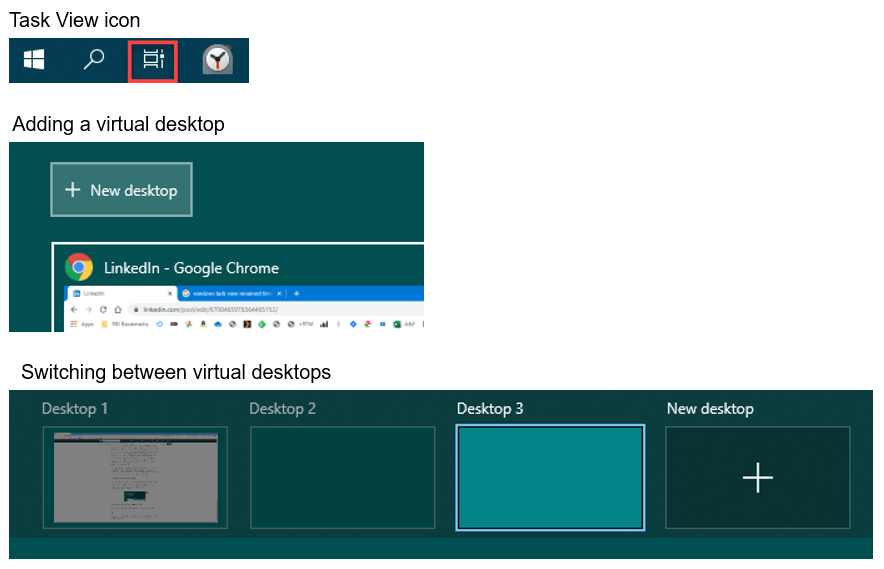

# Using Virtual Desktops in Windows 10
## Introduction
I've always been aware of virtual desktops, but, as someone who has a dual monitor setup (2x2560x1440) I never thought virtual desktops were something that would benefit me. I always assumed that they would mostly be of benefit to people who only had access to a single, small display (it turns out that the opposite is true).

## A typical day
On any typical workday I might have the following applications open on my PC:

Tasks (Outlook for Web), Agenda (Outlook for Web), Email (Outlook for Web), MS Teams (chats and meetings), Journal (Excel, where I document my activities), WhatsApp (non-work chat), Signal (non-work chat), Feedly (news aggregator), BBC.co.uk (news), Confluence (User Stories), JIRA (backlog), Word, Excel, PowerPoint, Adobe Analytics (product analytics),Tableau (product analytics), Axure or Excalidraw (prototyping & sketching).

In turns out that these applications fit quite nicely into groups, where each group is based around different tasks:

1.  Plan, record, and communicate (Tasks, Agenda, Email, MS Teams, Journal)
2.  Taking a break (WhatsApp, Signal, Feedly, BBC News)
3.  Monthly reporting (Tableau, Adobe Analytics, Excel)
4.  User Story creation (Confluence, JIRA, Axure or Excalidraw)

1 & 2 are 'reference tasks', I need these open all day as I'll check them frequently, 3 & 4 are examples of 'focused tasks', this is where I'd spend the majority of my day (I'd typically never have more than 2 of these on the go at the same time). Each of the above task groups is mutually exclusive. I'm either drafting my monthly report or taking a break, I'm not documenting a User Story while also communicating with a colleague via MS Teams. Many of the apps within each task group benefits from being visible at the same time e.g. when I'm planning my day it's good to see my task list and agenda side-by-side, when I'm checking to see who is trying to contact me, it's good to see emails and MS Teams open at the same time. Taking the above into account, you end up with the following basic requirements:

1.  The ability to group multiple apps together (by task). i.e. form 'task groups'.
2.  The ability to view apps side-by-side within the task groups.
3.  The ability to only view one task group at a time.
4.  The ability to quickly switch between task groups.
5.  The Windows Taskbar is poorly named.

The Windows Taskbar does not show you a list of tasks, it shows you a list of apps (it's an "App bar"), and as I mention above, planning my day requires 2 apps, writing my monthly report requires 3 apps. There is no real task switcher in Windows i.e. there's nothing that allows you to easily switch between groups of apps (I think Windows Sets was Microsoft's proposed solution to this, it would have satisfied requirements 1, 3 & 4 from the list above....but not 2. But, it currently looks like Sets is not going to become a feature in Windows 10).

## Enter Virtual Desktops!
First, let's start with a definition of what a virtual desktop is:

> In computing, a virtual desktop is a term used with respect to user interfaces to describe ways in which the virtual space of a computer's desktop environment is expanded beyond the physical limits of the screen's display area through the use of software. This compensates for a limited desktop area and can also be helpful in reducing clutter.

Although virtual desktops have been around since the late 1980s, they were not available natively in Windows until the launch of Windows 10. Because virtual desktops are discrete, make full use of the real desktop, and allow fast switching via keyboard shortcuts, they satisfy all 4 requirements from my list.

### An example
To keep things simple, I'm going to assume that I'm only working on a single focused task and am not taking any breaks. This leaves me with only two task groups required for my day i.e. 1) plan, record & communicate, 2) monthly reporting. For me, these task groups would look like those displayed in the image below:

tasksagendaemailteams (chat)journal (log)Virtual Desktop 1webExcelVirtual Desktop 2Ctrl + Win +Ctrl + Win +Plan & recordCommunicationOnly the apps required for a single task

[Click here to view full size in a new tab](/images/using-virtual-desktops.svg)

As I have a dual monitor setup, each virtual desktop includes both monitors. My first virtual desktop includes three web instances of Outlook (tasks, calendar, and emails), MS Teams (for chat and meetings), and Excel (for my journal). The second virtual desktop includes a web browser (product analytics via Adobe Analytics and Tableau) and Excel (monthly report). All the apps are open and sized appropriately, so there's no need to switch between, minimise, maximise, resize, or drag any windows. The only "window management" that's required is via the keyboard shortcuts that enable moving between virtual desktops i.e. Ctrl+Win+LeftArrow and Ctrl+Win+RightArrow. And it's this change that I believe is what makes virtual desktops so valuable.

It was only when I started to use virtual desktops in this way that I realised how much time I was spending scanning the taskbar looking for apps, moving them around, resizing them, and opening and closing them. And I was repeating this process multiple times per day as I was switching between tasks. With virtual desktops, I'll set up my reference desktop as soon as I start my day, I'll check for any unread emails, and see what meetings and tasks I have scheduled, once that's done, I'll then setup my focused desktop. Every 1/2 hour or so I'll quickly switch back to my reference desktop to see if there are any new messages or meeting requests, if not, I'll jump straight back into my focused desktop. The process of switching takes less than a second, and I've not had to hunt and peck at the Taskbar, or do any window managed to achieve this.

Even in this simple example with only 2 task groups, I've saved myself a lot of window management, but, typically I'd have 4 virtual desktops on the go, I'd have my 'taking a break' group, and sometimes a second focused group (I find it hard to focus on a single task for 8 hours, so I like to switch between two different tasks whenever possible).

## Using Windows Virtual Desktops
To create a virtual desktop, click the Task View icon located on the Taskbar (or use the shortcut Win + Tab), then, in the top left corner, select "New desktop". To move between these 2 desktops, use Ctrl+Win+LeftArrow and Ctrl+Win+RightArrow.

While in the Task View, you can also drag apps into the virtual desktops, or right click the app and select "move to", to move apps between virtual desktops.

## What if I only have a small single display?
If you are limited to a single small display, then it's likely that you are running your apps maximised and using the Taskbar to quickly switch between them. If this is the case, then virtual desktops aren't going to provide you with any extra utility (at least not as far as I can tell, if you've found them useful in this scenario, then let me know).

## Summary
Virtual Desktops might not be for everyone, but since using them I've been surprised at how much more efficient I find my app management on Windows. Virtual Desktops is something I'll be sticking with, and I'm hoping that Microsoft continue to build on this new Windows 10 feature.