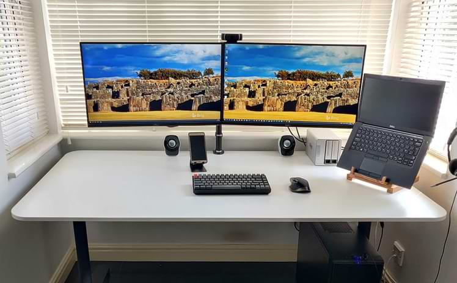
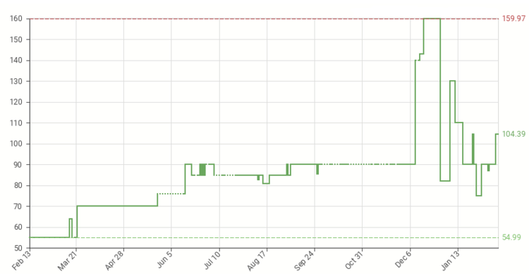

## The setup

Here's my WFH components:

- 2xDell U2715H monitors (27" 2560x1440)
- Logitech C920 HD webcam
- Logitech MX Master mouse
- TerraMaster F2-421 NAS (2x4GB raid 1)
- Keychron K2 keyboard (with Red switches)
- Ikea Bekant desk (160 cm x 80 cm)
- Dell D6000 Universal dock*
- Dell Latitude 7490 laptop*
- Plantronics C520 headset*

**provided by employer*

The setup is connected to a 300Mbps (down) and 40Mbps (up) Broadband connection [(g.fast)](https://en.wikipedia.org/wiki/G.fast) via Gigabit Ethernet.

## Outputs

### Monitors

If you are using a laptop when WFH and have NOT got it connected to an external monitor, for the love of God please just stop right now, go on Amazon, buy a new monitor (or two) and do not return to your laptop until after the new monitor arrives. There are lots of good ways to save money in life, not buying a decent monitor is not one of them!  **You are staring at your monitor for more that 8hrs a day, this is not a component where you want to cut corners and 'make-do'**. Your employer should provide you with a suitable monitor, or reimburse you if you buy your own. If your employer does not believe a good monitor is worthwhile, then hold off on ordering a new monitor from Amazon, as your highest priority is finding a new employer.

When deciding which monitor to choose, I'd suggest that anything with a resolution of 2560x1440 is the sweet spot for productivity\value.  A width of 2560px means you can have 2 apps of 1280px side-by-side, and most apps run well at 1280px. Your laptop display can be reserved for your more "reference" style apps, e.g. calendar, chat application, etc., while your main display is reserved for the apps required for you current focussed task.

### Speakers
Say something about headsets here

## Inputs

### Mice

Again, not a component where you want to make compromises. **I'd recommend any of the Logitech mice in the [MX Master series](https://www.logitech.com/en-gb/mx/master-series.html)**. They're geared towards productivity, and include enough useful features to make them good value for money. You don't have to get the latest version (the MX Master 3 retails for almost £100), the original version is often heavily discounted and sometimes dips below £50 [(view price history)](https://uk.camelcamelcamel.com/product/B00ULNAOMA).

### Keyboard

Whereas the benefit of a good monitor and mouse are clear, the return on investment of a good quality keyboard is less clear. Keyboards come in 2 main flavours:

1. The 'rubber dome' keyboards that you'll find on almost all office desks across the World, and the
2. 'mechanical' keyboards that you'll find on the desk of any discerning journalist, developer, or gamer.*

**and maybe on the desks of very discerning Product Managers :-)*

'Mechanical' and 'rubber dome' here refer to the type of switches used for each key to register the key's actuation. You can buy a good 'rubber dome' keyboard for less than £20. To get a good mechanical keyboard you're looking at at least £50, with serious mechanical keyboard enthusiasts (yes, it's a whole thing) spending £100+ on the keyboard itself, and then another £50+ on the keycaps (yes, that's also a whole thing). I have a mechanical keyboard on my desk, but I'm not recommending anyone goes out and buys a mechanical keyboard. I'd definitely put this component in the 'nice to have' bucket.

### Webcam

My wife and I both have the Logitech C920, this has been the 'go to' HD webcam for streamers for many years now. When I bought mine back in 2018 I paid just £35....today they cost closer to £100. You can see how the price has changed for this particular webcam since February 2020.

Before spending money on a price inflated HD webcam, the first thing to try is to improve your lighting. **There's no point having a good quality camera if you have a south facing window directly behind you**. Shut the blinds, and pick up some LED lighting that can be mounted on top of the monitor. Maybe then consider a good webcam (after supply has caught up with demand).

### Microphone
Say something about headsets here

## Other

### Ethernet

I was lucky enough to wire up the house with Ethernet (CAT6) in January 2020, just before the whole COVID-19 thing kicked off. At home I have number of bandwidth hungry stationary devices i.e. 3 TVs, 2 desktop PCs, and a NAS I also have a laptop (permanently on a desk), a Chromebook (that get's moved around a lot) and a very large number of IoT devices. As good as modern Wi-Fi is, it just doesn't have the same level of consistency that you get from Ethernet cable, and when you have 4 people potentially all on video calls at the same time, consistency is what you want. **If it is at all practical, I would strongly recommend wiring up your home for Ethernet**.

### Ergonomics

## Conclusions

I realise that my setup might be considered 'overkill', but my thinking is simple, I'm spending >8hrs per day sitting at that desk, staring at those screens, tapping on that keyboard and shifting around that mouse, therefore it's worth putting some thought (and some money) into those components.

